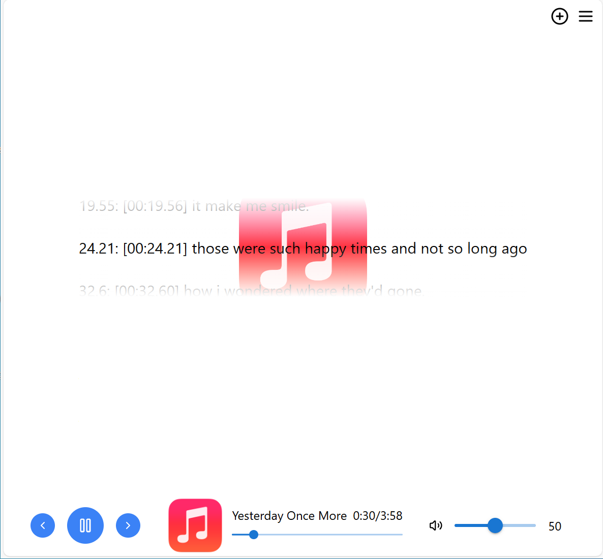

# MusicPlayer
Welcome to the MusicPlayer project! This is a simple yet powerful music player application designed to provide the best music experience.



## Features

- Play music files
- Support for various audio formats (e.g., MP3, WAV, FLAC)
- Volume control
- Display playback progress
- Show lyrics

## Installation

1. Clone this repository to your local machine:
  ```bash
  git clone https://github.com/yourusername/MusicPlayer.git
  ```
2. Navigate to the project directory:
  ```bash
  cd MusicPlayer
  ```
3. Install dependencies:
  ```bash
  npm install
  ```

## Usage

1. Start the application:
  ```bash
  npm start
  ```
2. Open your browser and visit `http://localhost:3000`.

## Contributing

Contributions are welcome! Please follow these steps:

1. Fork this repository
2. Create a new branch (`git checkout -b feature/your-feature`)
3. Commit your changes (`git commit -am 'Add some feature'`)
4. Push to the branch (`git push origin feature/your-feature`)
5. Create a new Pull Request

## License

This project is licensed under the MIT License. For more information, please refer to the [LICENSE](LICENSE) file.

## Contact

If you have any questions or suggestions, please contact us via:

- Email: support@musicplayer.com
- GitHub Issues: [https://github.com/yourusername/MusicPlayer/issues](https://github.com/yourusername/MusicPlayer/issues)

Thank you for using and contributing!
